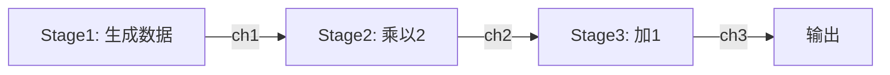

# golang-review
Review of Golang Grammar

## 1. Data Structures
bool, string, int, float, slice, map, struct, channel, wait group

## 2. High Concurrency
worker pool, fan-out fan-in, pipeline 

### 2.1 Worker Pool
                    ┌─────────┐
                    │ 任务生成  │
                    └────┬────┘
                         │
                         ▼
                    ┌─────────┐
                    │ 任务队列  │ (缓冲 channel)
                    └────┬────┘
                         │
           ┌─────────────┼─────────────┐
           │             │             │
           ▼             ▼             ▼
      ┌────────┐    ┌────────┐    ┌────────┐
      │Worker 1│    │Worker 2│    │Worker 3│  (固定数量)
      └───┬────┘    └───┬────┘    └───┬────┘
          │             │             │
          └─────────────┼─────────────┘
                        │
                        ▼
                   ┌─────────┐
                   │ 结果收集  │ (可选)
                   └─────────┘

### 2.2 Fan-Out/Fan-In
                    ┌─────────┐
                    │ 数据源   │
                    └────┬────┘
                         │
            ┌────────────┼────────────┐
            │            │            │
            ▼            ▼            ▼
      ┌──────────┐  ┌──────────┐  ┌──────────┐
      │Worker 1  │  │Worker 2  │  │Worker 3  │  (Fan-Out)
      └─────┬────┘  └─────┬────┘  └─────┬────┘
            │             │             │
            └─────────────┼─────────────┘
                          │
                          ▼
                    ┌─────────┐
                    │ 合并器   │  (Fan-In: 多个→一个 channel)
                    └────┬────┘
                         │
                         ▼
                    ┌─────────┐
                    │ 消费者   │
                    └─────────┘

### 2.3 Pipeline

| 模式               | 核心特点                                 | 典型用途                               |
| ------------------ | ---------------------------------------- | -------------------------------------- |
| Worker Pool        | 固定数量 worker 处理任务队列              | 控制并发度，避免 goroutine 爆炸        |
| Fan-Out/Fan-In     | 分发任务到多个 worker，再合并结果         | 并行处理多个子任务并汇总               |
| Pipeline           | 多个顺序阶段通过 channel 串联，各阶段可并发 | 流式数据处理，如 ETL、日志解析         |

## 3. HTTP Request
http client, status code, unmarshal